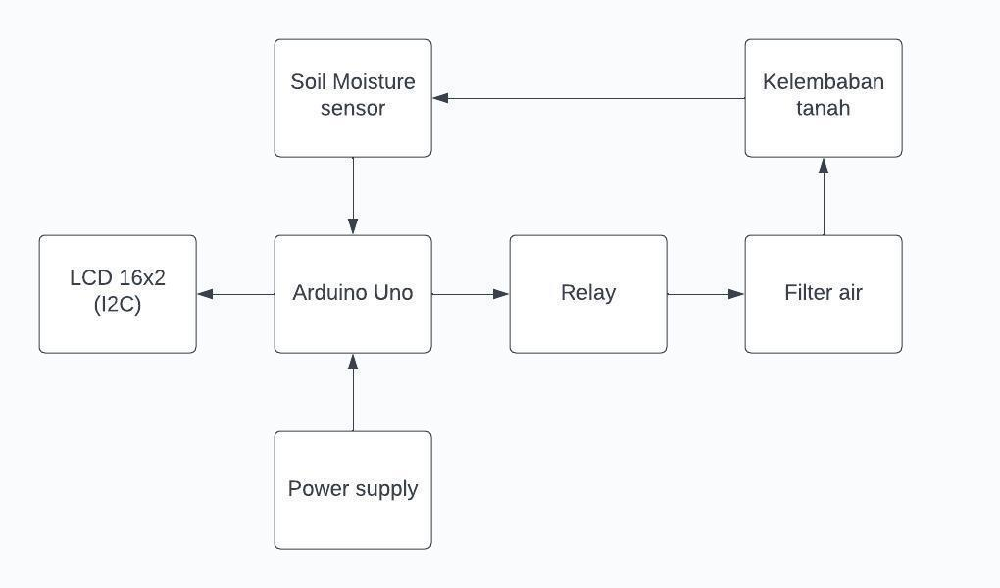
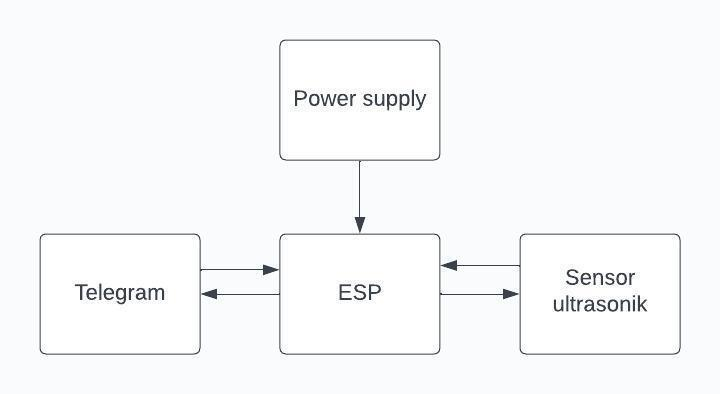
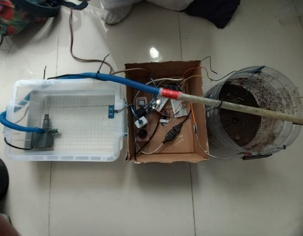

# IoT Water Monitoring System for Aquaponics (ESP8266 + Arduino)

## Ringkasan Proyek
Sistem monitoring dan otomasi air berbasis IoT untuk mendukung budidaya akuaponik (ikan lele + tanaman pakcoy). Sistem terdiri dari dua subsistem yang bekerja independen: (1) kontrol penyiraman otomatis berbasis sensor kelembaban tanah, dan (2) monitoring ketinggian air jarak jauh via bot Telegram menggunakan sensor ultrasonik dan ESP8266.

*Proyek kelompok (5 anggota) — mata kuliah Mikroprosesor & Antarmuka, Universitas Negeri Jakarta (2023).*

## Kenapa Sistem Akuaponik?
Penyiraman manual pada budidaya tanaman pakcoy tidak efisien dari segi waktu dan tenaga, terutama karena tanaman ini butuh kelembaban tanah yang stabil. Sistem akuaponik dipilih karena menggabungkan dua kebutuhan sekaligus: air dari kolam ikan lele mengandung nutrisi alami (limbah ikan sebagai pupuk organik) yang disalurkan ke tanaman, lalu air kembali ke kolam — menciptakan siklus tertutup yang lebih berkelanjutan dibanding sistem penyiraman konvensional.

## Alat dan Bahan
**Alat:** Arduino Uno, ESP8266 (NodeMCU), Sensor Soil Moisture (capacitive), Sensor Ultrasonik HC-SR04, Relay, LCD 16x2 (I2C), Breadboard, Kabel Jumper, Filter Akuarium (aktuator)
**Bahan:** Air, Ikan Lele, Pupuk Tanaman, Wadah dan Paralon

## Arsitektur Sistem
Sistem dipecah menjadi 2 subsistem independen:

**1. Soil Moisture + Relay (Arduino Uno)**
Membaca kelembaban tanah secara kontinu, mengontrol relay untuk menyalakan/mematikan aliran air berdasarkan ambang batas 71%, dan menampilkan status di LCD.



**2. Ultrasonik + ESP8266 + Telegram Bot**
Membaca ketinggian air pada wadah (rentang 1-20 cm) dan mengirim notifikasi ke Telegram menggunakan library CTBot. Monitoring dapat dikontrol dua arah lewat perintah teks: ketik `Info` untuk mulai menerima notifikasi, `Sip` untuk menghentikannya.



## Prototipe



## Analisis Bug: Logika Relay Terbalik

Laporan asli mencatat adanya kesalahan sistem: relay menyala saat tanah **sudah basah** dan mati saat tanah **kering** — kebalikan dari perilaku yang diinginkan. Laporan menduga penyebabnya adalah kurangnya sensitivitas sensor.

**Setelah menelusuri kode program**, ditemukan bahwa akar masalahnya bukan pada sensitivitas sensor, melainkan **kesalahan logika kondisional** pada kode:

```cpp
// Kode asli (bug)
if (kelembabanPersen < 71) {
    digitalWrite(relayPin, LOW);  // Relay OFF saat kering — seharusnya ON
} else {
    digitalWrite(relayPin, HIGH); // Relay ON saat basah — seharusnya OFF
}
```

Cabang `if`/`else` tertukar terhadap logika yang diinginkan: seharusnya relay **menyala (ON)** ketika tanah **kering** (`< 71%`) agar air mengalir, dan **mati (OFF)** ketika tanah **sudah basah** (`≥ 71%`). Versi kode yang sudah dikoreksi tersedia di [`arduino_code/soil_moisture_relay.ino`](arduino_code/soil_moisture_relay.ino), lengkap dengan komentar yang membandingkan versi asli vs versi perbaikan.

**Insight ini penting** karena menunjukkan pentingnya menelusuri kode secara langsung saat debugging — gejala yang terlihat seperti "masalah hardware/sensitivitas sensor" ternyata bersumber dari **logika program**, bukan karakteristik fisik sensor.

## Catatan Keamanan: Kredensial pada Kode Asli

Kode ESP8266 pada laporan asli menyertakan **WiFi password dan Telegram Bot Token secara hardcoded** langsung di source code. Ini adalah praktik yang tidak aman untuk kode yang dipublikasikan — token bot yang bocor dapat disalahgunakan pihak lain untuk mengontrol bot Telegram terkait. Versi kode di repository ini ([`arduino_code/esp8266_ultrasonic_telegram.ino`](arduino_code/esp8266_ultrasonic_telegram.ino)) sudah diganti dengan placeholder (`NAMA_WIFI_ANDA`, `TELEGRAM_BOT_TOKEN_ANDA`) — praktik yang seharusnya diterapkan sejak awal, idealnya dengan memindahkan kredensial ke file konfigurasi terpisah yang tidak ikut di-commit ke version control.

## Dokumentasi Lengkap
📄 Dokumentasi teknis lengkap (latar belakang, kajian teori, metodologi, hasil pembahasan) tersedia di [`docs/laporan_teknis_pakcoy_iot.pdf`](docs/laporan_teknis_pakcoy_iot.pdf)

## Kesimpulan
Sistem berhasil mengotomasi dua aspek penting budidaya akuaponik: kontrol kelembaban tanah dan monitoring ketinggian air jarak jauh. Bug logika relay yang ditemukan menunjukkan pentingnya code review yang teliti — kesalahan yang tampak seperti masalah hardware ternyata murni kesalahan logika program, dan dapat diperbaiki tanpa perlu mengganti komponen apa pun.

## Skill yang Didemonstrasikan
- Integrasi multi-mikrokontroler (Arduino Uno + ESP8266/NodeMCU)
- IoT connectivity: WiFi, Telegram Bot API (library CTBot)
- Kontrol otomatis berbasis ambang batas (threshold-based actuation)
- Komunikasi dua arah (command-response system via chat bot)
- Debugging & root cause analysis pada logika program
- Keamanan kode: identifikasi dan mitigasi hardcoded credentials
- Kerja tim dalam proyek rekayasa lintas-disiplin (elektronika + biologi/pertanian)

## Struktur Repository
```
├── README.md
├── arduino_code/
│   ├── soil_moisture_relay.ino
│   └── esp8266_ultrasonic_telegram.ino
├── images/
│   ├── diagram_alir_soil_moisture.jpg
│   ├── diagram_alir_ultrasonik_telegram.jpg
│   └── prototipe_keseluruhan.jpg
└── docs/
    └── laporan_teknis_pakcoy_iot.pdf
```

## Referensi
- Abror, M. H. (2018). *Efektifitas pupuk organik cair limbah ikan dan Trichoderma sp terhadap pertumbuhan dan hasil tanaman kailan*. Jurnal Agrosains dan Teknologi.
- Heriyawan, I. M. (2022). *Analisis Monitoring dan Kontrol Nilai Kelembaban Tanah dengan Sistem Smart Farming dan Soil Meter*. Jurnal Teknologi Pertanian Andalas.
- Pratopo, L. H. (2021). *Produksi Tanaman Kangkung dan Ikan Lele dengan Sistem Akuaponik*. Paspalum: Jurnal Ilmiah Pertanian.
- Riasti, S. R. (2021). *Pakcoy Plant Sprinklers Based Internet of Things*. Jurnal Transformatika.
